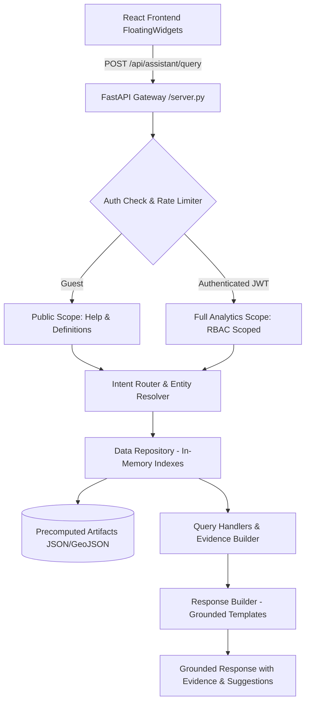

# Nirikshak AI — Decision Support Assistant

## Overview

The **Nirikshak AI Decision Support Assistant** is an evidence-grounded, privacy-preserving assistant built into the Nirikshak AI platform. It answers questions about MPLADS projects, multi-signal anomaly detections, MP scorecards, constituency risk heatmaps, vendor market concentrations (HHI), and geographic risk clusters.

---

## 1. Architecture & Design Principles



### Strict Architectural Boundaries
- **Zero Database Connections:** The assistant never connects to PostgreSQL or executes SQL queries. All knowledge is derived from precomputed JSON and GeoJSON analytical artifacts.
- **Zero Heavy ML Imports:** The runtime server requires no heavy ML frameworks (`torch`, `sentence_transformers`, `sklearn`, `networkx`). It runs efficiently on lightweight production infrastructure.
- **No External Web Access:** The assistant never accesses external websites or scrapes data.
- **Strict Grounding:** Every numerical score, risk rating, and evidence item is traceable directly to precomputed artifacts.
- **Responsible Language:** Uses non-defamatory, explainable terminology (*"Anomaly detected"*, *"Candidate duplicate"*, *"Structural concentration"* rather than premature fraud claims).

---

## 2. Supported Intents & Capabilities

| Intent | Description | Sample Query | Supported Artifacts |
|---|---|---|---|
| `help_capabilities` | Capabilities & usage overview | *"What can you help me with?"* | Manifest & Glossary |
| `explain_project_risk` | Explain multi-factor risk for a project | *"Why is work 105744 high risk?"* | `unified_project_evaluations.json`, `finguard_anomalies.json`, `cost_and_delay_anomalies.json` |
| `find_high_risk` | List highest-risk projects | *"Show top 5 high-risk projects in Bihar"* | `unified_project_evaluations.json` |
| `cost_delay_anomalies` | Cost overruns & completion delays | *"Show projects delayed by more than one year"* | `cost_and_delay_anomalies.json`, `finguard_anomalies.json` |
| `duplicate_alerts` | Candidate duplicate project pairs | *"Find duplicate alerts involving work 158087"* | `duplicate_project_alerts.json` |
| `mp_scorecard` | MP integrity & project summary | *"Summarize scorecard for MP Ashwini Vaishnaw"* | `mp_scorecard_summary.json` |
| `compare_mps` | Compare 2 MPs on key metrics | *"Compare MP Rajiv Pratap Rudy and MP Ashwini Vaishnaw"* | `mp_scorecard_summary.json` |
| `constituency_risk` | Risk & fund profile of a constituency | *"Summarize risk in Jabalpur"* | `constituency_risk_heatmap.json`, `finguard_constituency_summary.json` |
| `vendor_concentration` | Vendor concentration & HHI analysis | *"Which vendors have high concentration risk?"* | `vendor_risk_network.json`, `constituency_hhi.json` |
| `geospatial_intel` | Geographic risk clusters | *"Show geographic risk clusters"* | `geointel_heatmap.geojson` |
| `definition` | Analytical terms & methodology | *"What does HHI mean?"*, *"Does HHI prove corruption?"* | Curated Glossary |

---

## 3. Data Lineage & Artifact Registry

Precomputed artifacts are generated by the local analytical pipeline (`export_live_results.py` and `build_assistant_index.py`) and placed in `frontend/public/data/`:

| Safe Identifier | Filename | Record Count | Key Fields |
|---|---|---|---|
| `unified_evaluations` | `unified_project_evaluations.json` | 1,000 | `work_id`, `cost_z_score`, `delay_z_score`, `agency_risk_tier`, `is_high_risk` |
| `cost_delay_anomalies` | `cost_and_delay_anomalies.json` | 1,000 | `work_id`, `severity_score`, `cost_overrun_pct`, `completion_delay_days` |
| `duplicate_alerts` | `duplicate_project_alerts.json` | 1,000 | `work_id_A`, `work_id_B`, `risk_confidence_score`, `text_similarity_score` |
| `mp_scorecards` | `mp_scorecard_summary.json` | 1,198 | `mp_id`, `mp_name`, `composite_integrity_score`, `total_works` |
| `constituency_risk` | `constituency_risk_heatmap.json` | 65 | `const_name`, `total_projects`, `high_risk_projects`, `total_sanctioned` |
| `constituency_hhi` | `constituency_hhi.json` | 63 | `constituency_name`, `hhi`, `dominant_vendor`, `dominant_vendor_share` |
| `vendor_risk_network` | `vendor_risk_network.json` | 20 | `vendor_name`, `risk_score`, `constituencies_operated`, `total_funds_captured` |
| `vendor_cartel_groups` | `vendor_cartel_groups.json` | 2,419 | `cartel_id`, `members` |
| `finguard_anomalies` | `finguard_anomalies.json` | 2,000 | `work_id`, `financial_risk_score`, `anomaly_reasons`, `recommended_actions` |
| `finguard_constituency` | `finguard_constituency_summary.json` | 65 | `const_name`, `total_high_risk_leaks`, `ghost_count`, `utilization_rate` |
| `geointel_heatmap` | `geointel_heatmap.geojson` | ~500 | `const_name`, `spatial_risk_score`, `cluster_id`, `high_risk_projects` |
| `real_projects` | `real_projects.json` | 4,686 | `id`, `title`, `category`, `cost`, `status` |
| `export_manifest` | `export_manifest.json` | 1 | `sync_timestamp`, `dataset_version_hash`, `total_records_analyzed` |

---

## 4. API Specification

### Endpoint: `POST /api/assistant/query`

#### Request Body
```json
{
  "message": "Why is work 105744 high risk?",
  "conversation_id": "conv-1718000000-abc12",
  "context": {
    "current_page": "/dashboard/investigation",
    "selected_work_id": "105744",
    "selected_constituency": "ANAKAPALLE",
    "selected_state": "Andhra Pradesh"
  }
}
```

#### Response Body
```json
{
  "status": "success",
  "intent": "explain_project_risk",
  "answer": "**Work 105744**: Construction of Community Hall...\n⚠️ Risk Level: **HIGH RISK**\n💰 Cost Z-Score: 2.85\n⏱️ Completion Delay: 420 days\n🔍 Financial Risk Score: 85",
  "entities": {
    "work_id": "105744",
    "limit": 5
  },
  "evidence": [
    {
      "label": "Risk Level",
      "value": "HIGH RISK",
      "source": "Unified Evaluations",
      "record_id": "105744"
    },
    {
      "label": "Cost Z-Score",
      "value": "2.85",
      "source": "Unified Evaluations",
      "record_id": "105744"
    }
  ],
  "suggestions": [
    "Show duplicate alerts for work 105744",
    "Show top cost anomalies in Andhra Pradesh"
  ],
  "data_snapshot": {
    "generated_at": "2026-08-30T04:56:11.444650",
    "version": "deda45d84faf",
    "total_records_analyzed": 218913
  },
  "disclaimer": "This is an anomaly signal generated by Nirikshak AI's analytical models. It requires authorized human verification before any action is taken."
}
```

---

## 5. Security, RBAC & Configuration

### Environment Variables
| Variable | Description | Default |
|---|---|---|
| `NIRIKSHAK_DATA_DIR` | Directory containing precomputed artifacts | `frontend/public/data` |
| `ASSISTANT_MODE` | Assistant mode (`deterministic` or `llm`) | `deterministic` |
| `ASSISTANT_LLM_PROVIDER` | Optional LLM provider (`openai` or `google`) | `""` |
| `ASSISTANT_LLM_API_KEY` | Optional LLM API Key (kept secure on server) | `""` |
| `ASSISTANT_LLM_MODEL` | Optional LLM model identifier | `""` |

### Role-Based Access Scopes
- **Guest / Unauthenticated:** Allowed `help_capabilities` and `definition` glossary queries.
- **Authenticated Officer (Any Role):** Full access to analytical results, scoped to authorized jurisdiction.

---

## 6. Verification & Automated Testing

Run the full assistant test suite:
```bash
python -m pytest backend/tests/test_assistant.py -v
```
All 61 unit and golden-question tests validate safety, grounding, zero SQL imports, Pydantic schemas, and responsible terminology.
